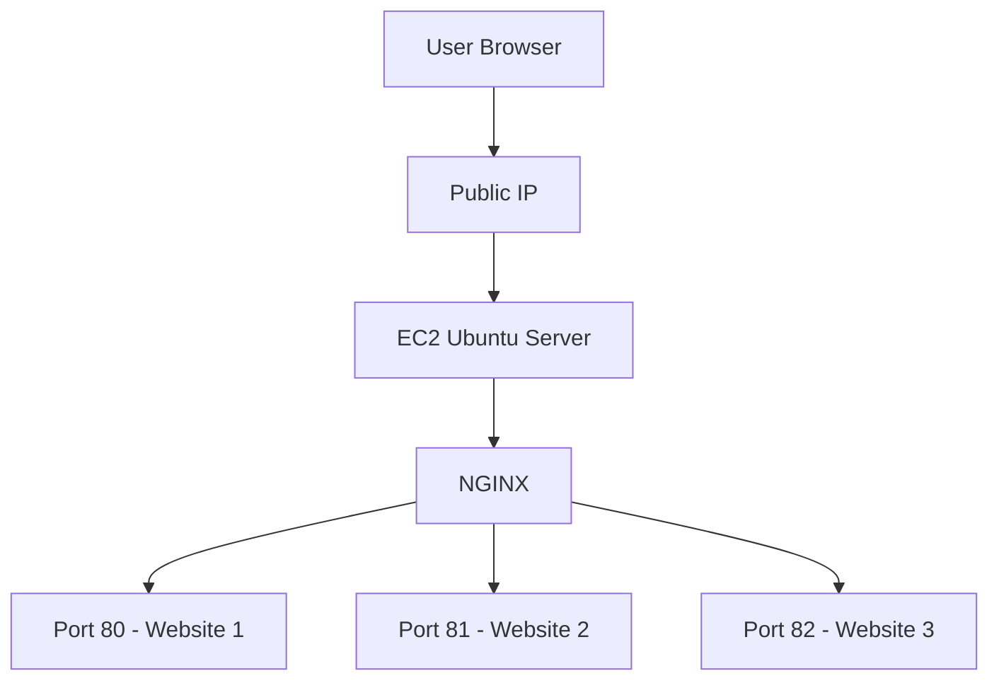

# 🚀 Multi Static Website Hosting on Single EC2 Instance


---

## 📌 Project Overview

This project demonstrates how to host **three static websites** on a **single Amazon EC2 instance** using **NGINX** without Docker or containerization tools.

The setup uses **port-based virtual hosting** and includes complete configuration, networking, security, and deployment steps.

---

## 📚 Table of Contents

- Architecture Overview
- Technology Stack
- Infrastructure Setup
- NGINX Configuration
- Security Configuration
- Network Flow Explanation
- Testing & Validation
- Logs & Monitoring
- Performance Optimization
- Comparison: Port vs Name Based Hosting
- Troubleshooting
- Interview Questions
- Resume Highlights
- Future Enhancements
- License

---

# 🏗️ Architecture Overview

## 🔹 High-Level Diagram

```
                 Internet
                     │
                     ▼
              ┌────────────────┐
              │   EC2 Instance │
              │   Ubuntu 22.04 │
              └────────────────┘
                     │
                     ▼
                 ┌────────┐
                 │ NGINX  │
                 └────────┘
                   │  │  │
         ┌─────────┘  │  └─────────┐
         ▼            ▼            ▼
      Port 80      Port 81      Port 82
         │            │            │
     Website 1    Website 2    Website 3
```

---

## 📊 Mermaid Diagram



---

# 🛠️ Technology Stack

| Component | Description |
|------------|-------------|
| AWS EC2 | Cloud Virtual Server |
| Ubuntu 22.04 | Operating System |
| NGINX | Web Server |
| Security Group | Network Firewall |
| Systemd | Service Management |

---

# 🖥️ Infrastructure Setup

## 1️⃣ Launch EC2 Instance

- AMI: Ubuntu 22.04
- Instance Type: t2.micro
- Open Ports:
  - 22 (SSH)
  - 80 (HTTP)
  - 81 (Custom TCP)
  - 82 (Custom TCP)

---

# 📦 Install NGINX

```bash
sudo apt update
```
```
sudo apt install nginx -y
```
```
sudo systemctl start nginx
```
```
sudo systemctl enable nginx
```
---

# 📁 Directory Structure

```
/var/www/html/
│
├── website-1/
│   └── index.html
│
├── website-2/
│   └── index.html
│
└── website-3/
    └── index.html
```

---

# ⚙️ NGINX Configuration

Edit:

```bash
sudo nano /etc/nginx/sites-available/default
```

Configuration:

```nginx
server {
    listen 80 default_server;
    root /var/www/html/website-1;
    index index.html;
}

server {
    listen 81;
    root /var/www/html/website-2;
    index index.html;
}

server {
    listen 82;
    root /var/www/html/website-3;
    index index.html;
}
```

Test & Restart:

```bash
sudo nginx -t
sudo systemctl restart nginx
```

---

# 🔐 Security Configuration

## Security Group Rules

| Port | Purpose |
|------|---------|
| 22 | SSH Access |
| 80 | Website 1 |
| 81 | Website 2 |
| 82 | Website 3 |

---

# 🌐 Network Flow Explanation

1. User sends request to Public IP.
2. AWS routes traffic to EC2 instance.
3. NGINX listens on specific port.
4. Based on port, NGINX serves corresponding website directory.
---

# 🔄 Port-Based vs Name-Based Hosting

| Feature | Port-Based | Name-Based |
|----------|------------|------------|
| Uses Different Ports | ✅ | ❌ |
| Uses Domains | ❌ | ✅ |
| Beginner Friendly | ✅ | ⚠️ |
| Production Ready | ⚠️ | ✅ |

---

# 🧪 Testing URLs

```
http://your-public-ip
http://your-public-ip:81
http://your-public-ip:82
```

---

# 🚨 Troubleshooting

## Check NGINX Status

```bash
sudo systemctl status nginx
```

## Check Open Ports

```bash
sudo netstat -tulpn
```

---

# 🎯 Interview Questions

- How does NGINX handle multiple websites?
- What is virtual hosting?
- Why only one default_server?
- Difference between Apache and NGINX?
- How would you scale this architecture?

---

# 📝 Resume Highlights

- Configured multi-site hosting on single EC2 instance
- Implemented port-based virtual hosting using NGINX
- Managed Linux server and networking
- Configured AWS Security Groups
- Troubleshot web server and firewall issues

---

# 🚀 Future Enhancements

- Add HTTPS with Let's Encrypt
- Implement Load Balancer
- Configure Auto Scaling
- Add CI/CD pipeline
- Migrate to Name-Based Virtual Hosting

---

# 👨‍💻 Author

Prasad Bhoite  
DevOps & Cloud Enthusiast

---
## 📩 Connect With Me :-

If you’d like to collaborate, discuss projects, or just say hello — feel free to reach out!  

### 🔗 Social & Professional Links
- 🌐 [Portfolio Website](https://prasad-bhoite19.github.io/prasad-portfolio/)  
- 💼 [LinkedIn](http://linkedin.com/in/prasad-bhoite-a38a64223)  
- 🐙 [GitHub](https://github.com/Prasad-bhoite19)  
- ✉️ [Email](prasadsb2002@gmail.com)  

💬 Always open for opportunities in **Cloud, DevOps, and Full-Stack Projects**
⭐ If you found this project useful, give it a star!
